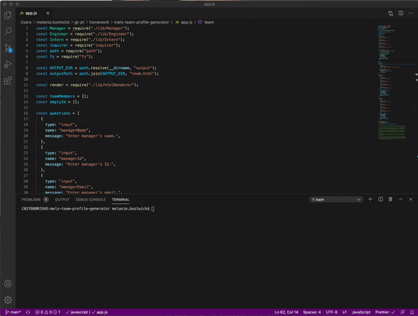
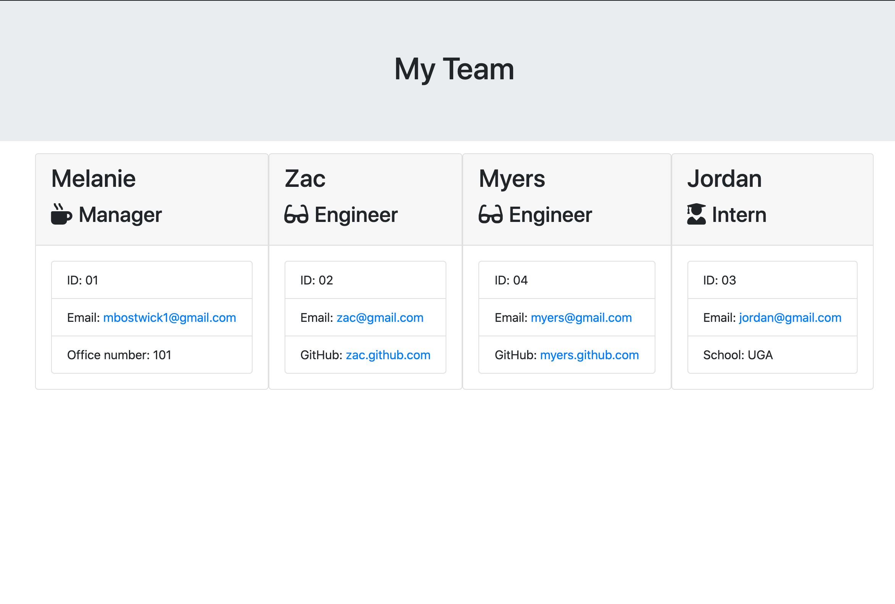

# mels-team-profile-generator

## Table of Contents

* [Description](#Description)
* [Installation](#installation)
* [Usage](#usage)
 
 ## Description
 
 [GitHub](https://github.com/mbostwick1/mels-team-profile-generator)
  
  - This Node CLI app retreives user input to create a team with all employees involved and generates a .html with full descriptions.
  
  - Each employee (manager, engineer, intern) has a specific set of information to display with role title. User can add multiple team members and choose when finished adding to the team.

## Installation
 
   - Important: install node modules with npm install
 
   - To generate content, open app.js. Inside of the terminal, follow prompts and enter employee information.
 
   - Once completed, a team.html will export into the output folder. All employees will be listed with the information provided.
 
 ## Usage

 
 

